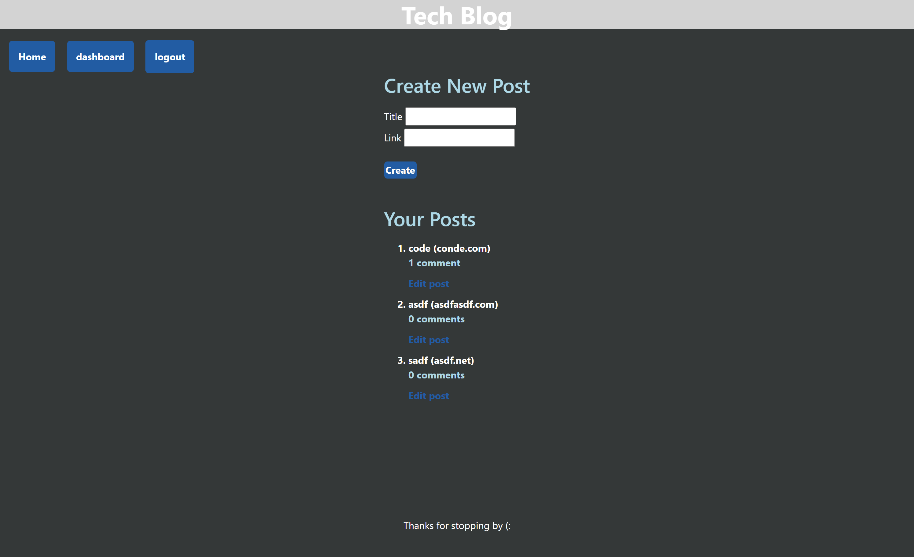

# tech-blog

## Description 
  This application generates a blow=g webpage using express, mysql2, sequelize, bootstrap, html, & css. Upon visiting the user can sign up or login. Once the user is signed up/loged in for the blog website then they can add new post, comment, and delete their own post. They can also view all other post existing. This application also includes test that check to see if the creation criteria for the username and password are valid.

   A screenshot of the deployed application is attached below.

  
  ## Table of Contents
  - [Description](#description)
  - [Installation](#installation)
  - [Usage](#usage)
  - [License](#license)
  - [Contributing](#contributing)
  - [Tests](#tests)
  - [Questions](#questions)

  ## Installation 
  - Use a Termal or GitBash
  - Install dotenv package
    - npm install dotenv
  - Install Sequelize package
    - npm install console.table --save
  - Install MySQL2 package 
    - npm install --save mysql2
  - Install jest 
    - this is done via npm install --save-dev jest
  - Install Node
    - this is done via the following command line: "npm i"
    - "npm -v" to see current version on node
  - Use any compatible text editor
  - Clone or fork this repository to desired workstation

  ## Usage 
  Start the application by calling the file npm start in either Terminal or GitBash. From there the user can view if there are any existing posts and us the dashboard for quick access to other parts of the site. They are also prompted to either sign up or login with a username and password. Once loged in the user can view all the post. They can also make comments to to other posts. If the user has created post then they can edit their post and even delete it. Once done the user can then log out, but can still all the posts that are in the blog site.

  
  
  ## License
  - This project is under the [MIT](https://opensource.org/licenses/MIT) license. 

  ## Questions
  - Feel free to reach me via GitHub or Email with any questions regarding this project
  - GitHub: [georgedmendoza](https://github.com/georgedmendoza)
  - Email: [georgedmendoza13@gmail.com](mailto:georgedmendoza13@gmail.com)

